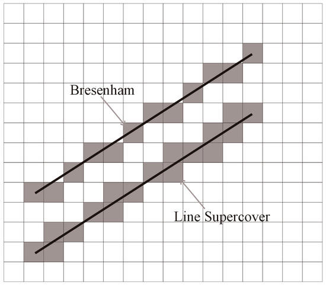

<h1 align="center"> RayCasting </h1>
<p align="center">A datapack to get ray-casting collision position</p>

## 개요

<video src="/doc/RayCasting_test.mp4" controls="true" width="600"></video>

## 사용방법
RayCast용 툴을 사용하여 시각화할 수 있다.
```mcfunction
function ray:get_tool
```

## 원리



기존 Bresenham의 한계를 극복한 3D Supercover DDA 알고리즘 중 하나인 정수연산기반 Amanatides & Woo의 방식을 사용하였다.

```
# -- basic functions --

function sgn(x):
    if x == 0: return x
    return x/x

function floor(x):
    return x - (x % 1)

function abs(x):
    if x < 0: return -x
    return x

# -- main --
현재위치(눈을 기준으로) o = (ox, oy, oz)
시선방향 단위벡터 d = (dx, dy, dz)

stepX, stepY, stepZ = sgn(dx), sgn(dy), sgn(dz)

nextX = floor(ox)
nextX = floor(ox)
nextX = floor(ox)
if stepX > 0: nextX += 1
if stepY > 0: nextY += 1
if stepZ > 0: nextZ += 1

eX, eY, eZ = nextX - ox, nextY - oy, nextZ - oz

visited = [] # 조사 대상이 된 블록의 좌표
collapsed = 0
while collapsed == 0:

    cmpXY = abs(eX * dy) - abs(eY * dx)
    cmpYZ = abs(eY * dz) - abs(eZ * dz)
    cmpZX = abs(eZ * dx) - abs(eX * dz)

    if dx != 0 & cmpXY < 0 & cmpZX > 0:
        t = abs(eX / dx)
        eX, bX += stepX
    if dy != 0 & cmpYZ < 0 & cmpXY > 0:
        t = abs(eY / dy)
        eY, bY += stepY
    if dz != 0 & cmpZX < 0 & cmpYZ > 0:
        t = abs(eZ / dz)
        eZ, bZ += stepZ
    visited.append((bx, by, bz))

    if (bx, by, bz) 좌표에 공기가 아닌 블록이 존재한다:
        collapsed = 1
        c = (dx * t, dy * t, dz * t) # 충돌 좌표

endwhile
```